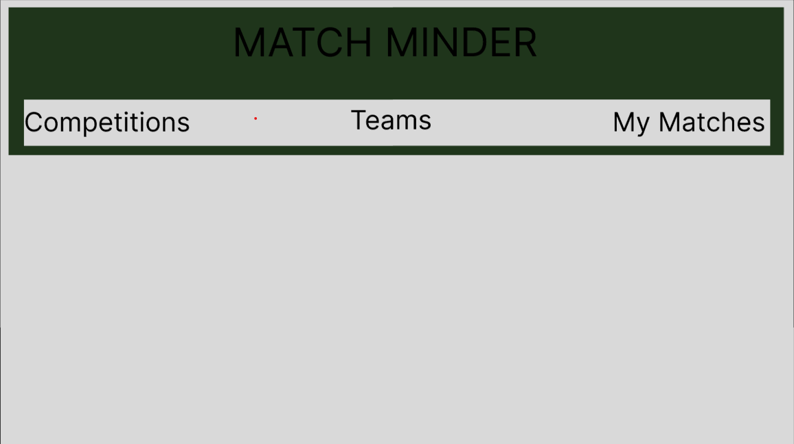
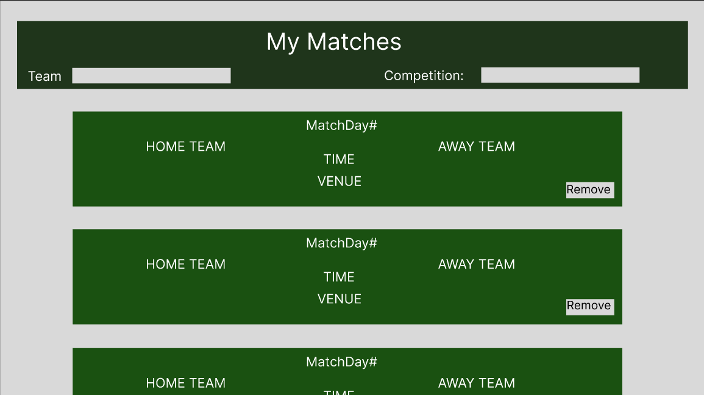
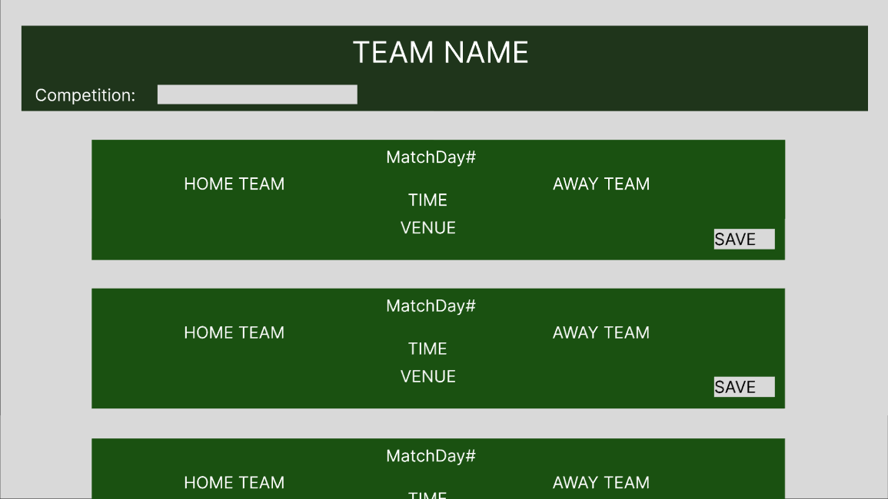

# Match-Minder

DESCRIPTION: Match-Minder is an online tool for tracking upcoming soccer games/league tables/scores across a variety of leagues and competitions (both domestic leagues such as the English Premier League and also International competitions like the World Cup). Users can view this data without an account or signup to track the teams or competitions they care about.

### Models

| USERS      |                   |
|------------|-------------------|
| ID         | int (primary_key) |
| email      | string (unique)   |
| password   | string            |
| bio        | string            |
| created_at | dateTime          |
| updated_at | dateTime          |

| Match       |                   |
|-------------|-------------------|
| ID          | int (primary_key) |
| matchDay    | int               |
| HomeTeamID  | int (foreignKey)  |
| AwayTeamID  | int (foreignKey)  |
| AreaID      | int               |
| AreaName    | string            |
| utcDate     | string            |
| competition | string            |
| winner      | string            |

| Team         |                   |
|--------------|-------------------|
| ID           | int (primary_key) |
| Name         | string            |
| shortName    | string            |
| crestImg     | string            |
| venue        | string            |
| clubColors   | string            |
| competitions | int (foreignKey)  |

| SavedMatch |                   |
|------------|-------------------|
| ID         | int (primary_key) |
| USerID     | int(foreignKey)   |
| MatchID    | int(foreignKey)   |

### API-ROUTES

| API Route                   | Request Method    |
|-----------------------------|-------------------|
| /api/users                  | GET, POST, PATCH  |
| /api/teams/<int:id>         | GET               |
| /api/teams/<int:id>/matches | GET               |
| /api/competitions           | GET               |
| /api/competitions/teams     | GET               |
| /api/savedmatch/<int:id>    | GET, POST, DELETE |
| /api/match/<int:id>         | GET               |

### CLIENT-ROUTES

| Client Route | Component                |
|--------------|--------------------------|
| /            | Home.jsx                 |
| /signup      | Signup.jsx               |
| /login       | Login.jsx                |
| /team        | MatchesByTeam.jsx        |
| /competition | MatchesByCompetition.jsx |
| /mymatches   | MyMatches.jsx            |

### WireFrames

